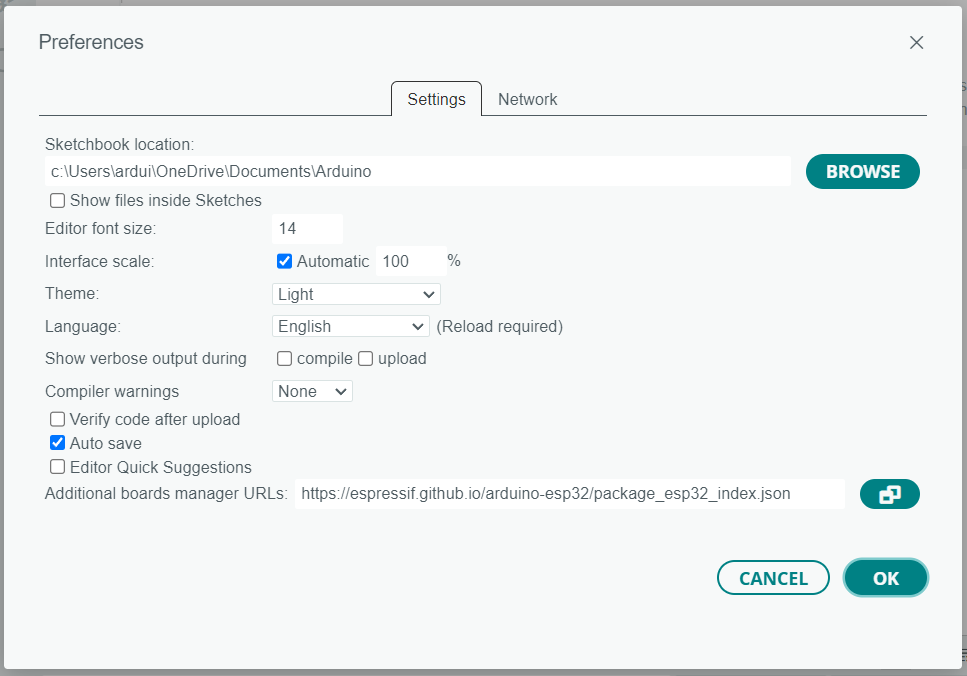
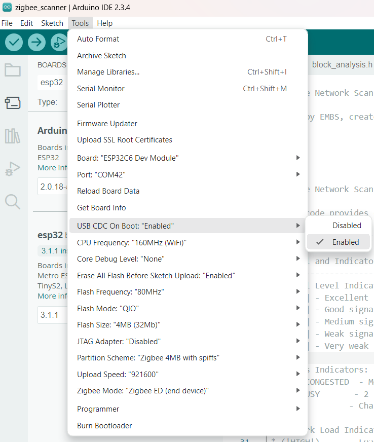

# ZigBee Network Scanner

There is a fundamental challenge with ZigBee networks - it is practically impossible to predict signal quality and interference levels. We could not find an adequate measurement instrument and therefore have developed our own solution.

We have created a **free** open-source implementation utilizing the ESP32-C6 dev kit (market alternative: **€2000**).

Arduino has been selected as the development platform due to its accessibility for **beginners**.

**Requirements**

ESP32-C6-DevKitC-1-N8 board, available from [Mouser](https://eu.mouser.com/ProductDetail/Espressif-Systems/ESP32-C6-DevKitC-1-N8?qs=8Wlm6%252BaMh8TjnOR8RwmaBw%3D%3D) or any other distributor like Digikey or TME.

Priced at **€8.55**

The scanner performs passive ZigBee network analysis by capturing beacons and device announcements.

The following information is sent to the Arduino Serial Monitor:

* **Network Discovery**: Identifies active networks, reporting PAN ID, channel, and device roles.
* **Signal Analysis**: Measures RSSI (converted to dBm) and visualizes signal strength as a bar indicator (e.g., [***-]).
* **Performance Metrics**: Calculates network load, packet loss, and retry rates to diagnose issues.
* **Diagnostics**: Tracks signal stability and historical RSSI trends for each network.

Scans are executed in configurable cycles, with results formatted as a summary table followed by detailed diagnostics.

Here's an example of what the device outputs when scanning ZigBee networks:

*A more detailed output (copied from the Arduino monitor).*

Initiating new scan cycle...
(Fast scanning mode active)
Scan started

No networks found, will scan again soon...

Initiating new scan cycle...
(Fast scanning mode active)
Scan started

Scan completed with status: 3

Scan completed. Networks found: 3

Scan data received successfully

=== NETWORK SCAN SUMMARY ===  
<pre style="font-family: 'Courier New', monospace; line-height: 1.2;">
+------------------+----+--------+------+---------+--------+------+----------+---------+
| PAN ID (dec/hex) | CH | Signal | Join | Routers | EndDev | Load | Security | Status  |
+------------------+----+--------+------+---------+--------+------+----------+---------+
| 32113/0x7d71     | 16 | [**--] | No   | Yes     | Yes    | 76%  | Secured  | New     |
| 14888/0x3a28     | 12 | [----] | No   | Yes     | Yes    | 77%  | Secured  | New     |
| 12450/0x30a2     | 18 | [***-] | Yes  | Yes     | Yes    | 99%  | Secured  | New     |
+------------------+----+--------+------+---------+--------+------+----------+---------+
</pre>

=== NETWORK DIAGNOSTICS ===

Network Analysis:

Network 0x7d71 (PAN ID: 32113):  
├─ Type: Router/End Device  
├─ Uptime: 5 sec  
├─ Current Signal: 113 [[**--]] (HIGH)  
├─ Packet Loss: 0.0% (OK)  
├─ Retry Rate: 0.0%  
├─ Signal Range: 113-113 (avg: 113)  
├─ Signal History [113]  
└─ No issues detected  

Network 0x3a28 (PAN ID: 14888):  
├─ Type: Router/End Device  
├─ Uptime: 5 sec  
├─ Current Signal: 40 [[----]] (HIGH)  
├─ Packet Loss: 0.0% (OK)  
├─ Retry Rate: 0.0%  
├─ Signal Range: 40-40 (avg: 40)  
├─ Signal History [40]  
└─ No issues detected  

Network 0x30a2 (PAN ID: 12450):  
├─ Type: Coordinator  
├─ Uptime: 5 sec  
├─ Current Signal: 162 [[***-]] (!HIGH!)  
├─ Packet Loss: 0.0% (OK)  
├─ Retry Rate: 0.0%  
├─ Signal Range: 162-162 (avg: 162)  
├─ Signal History [162]  
└─ No issues detected  

Waiting for next scan: 29 seconds

**Potential applications of this device:**

Evaluate the network quality at every specific point in your home. All you need is a laptop and an ESP32-C6 dev-kit with our firmware.

You will be able to perform:
* **Network Analysis**: Evaluate ZigBee signal strength and channel congestion in a specific environment.
* **Diagnostics**: Identify packet loss, retry rates, or weak signals to optimize network performance.

The provided information will allow creating a robust ZigBee network.

We have created a [support topic in our forum](https://forum.logicmachine.net/) for general questions and suggestions, feel free to join.

 

## Instruction to setup Arduino project for ZigBee Network Scanner

Download Arduino IDE Version 2.3.4.

Set the preferences

`https://espressif.github.io/arduino-esp32/package_esp32_index.json`

Download boards manager  
esp32 by Espressif Systems 3.1.1.

Select Board: ESP32C6 Dev Module

Select the COM port: Tools -> Port: xxx where the xxx is the detected COM port

USB CDC On Boot --> Enabled

Erase All Flash Before Sketch Upload --> Enabled

Select Partition Scheme for ZigBee: Tools -> Partition Scheme: ZigBee 4MB with spiffs

Select the End device ZigBee mode: Tools -> ZigBee mode: ZigBee ED (end device)

Now you can upload the sketch and use the ZigBee Network Scanner
